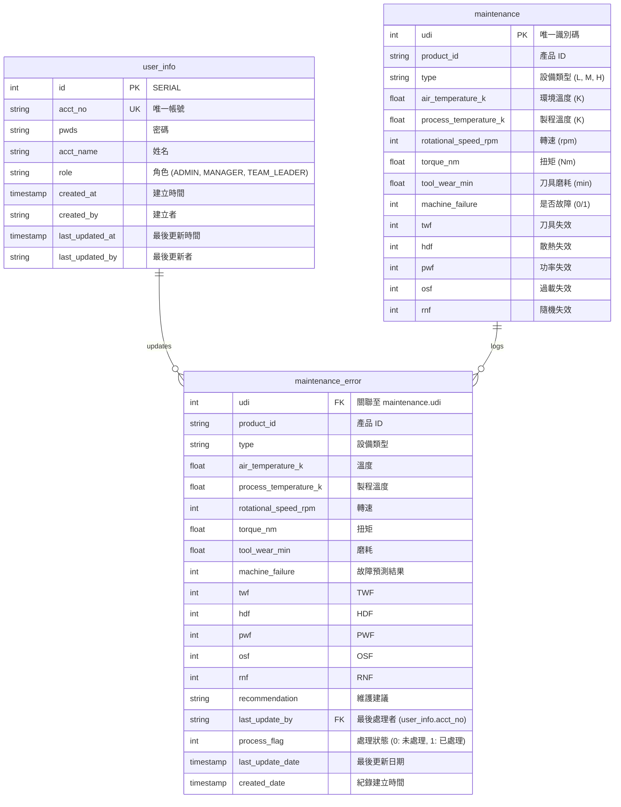

# 資料庫實體關係圖 (ERD)

本專案使用 Supabase (PostgreSQL) 作為資料庫，主要包含三個資料表。以下是其結構與關係：

### 關係說明：
1.  **[maintenance](file:///d:/homework/project1/predictive.py#396-407) 與 [maintenance_error](file:///d:/homework/project1/predictive.py#396-407)**:
    *   一對多關係。當系統偵測到 [maintenance](file:///d:/homework/project1/predictive.py#396-407) 表中的數據有異常或預測故障時，會將詳細資訊記錄到 [maintenance_error](file:///d:/homework/project1/predictive.py#396-407) 中。
    *   透過 `udi` 欄位進行關聯。
2.  **[user_info](file:///d:/homework/project1/init_db.py#19-62) 與 [maintenance_error](file:///d:/homework/project1/predictive.py#396-407)**:
    *   一對多關係。每個異常紀錄在處理時，會記錄是哪位使用者（`last_update_by`）進行了維護建議與狀態更新。
    *   透過 `user_info.acct_no` 進行關聯。
