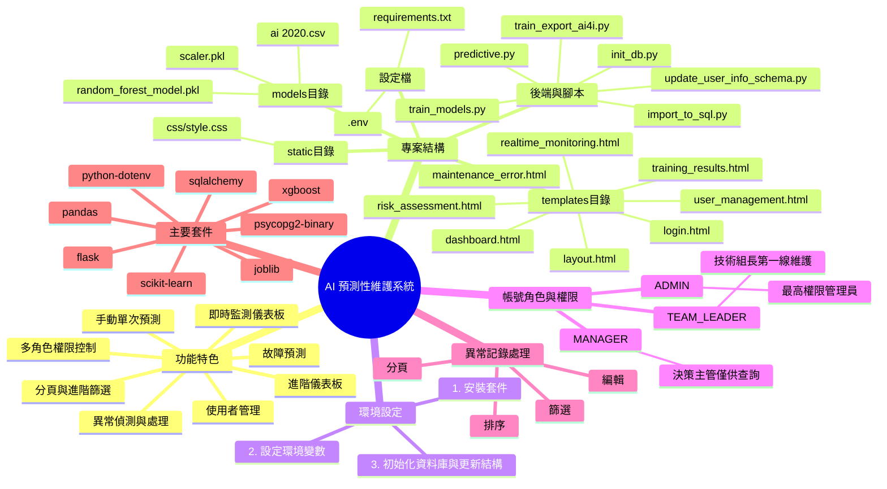

# AI 預測性維護系統心智圖

根據 [README.md](file:///d:/homework/project1/README.md) 的內容，以下是系統的心智圖結構：

```mermaid
mindmap
  root((AI 預測性維護系統))
    功能特色
      即時監測儀表板
      異常偵測與處理
      分頁與進階篩選
      故障預測
      手動單次預測
      進階儀表板
      使用者管理
      多角色權限控制
    專案結構
      後端與腳本
        predictive.py
        train_models.py
        train_export_ai4i.py
        import_to_sql.py
        init_db.py
        update_user_info_schema.py
      設定檔
        requirements.txt
        .env
      models目錄
        random_forest_model.pkl
        scaler.pkl
        ai 2020.csv
      templates目錄
        layout.html
        login.html
        user_management.html
        maintenance_error.html
        realtime_monitoring.html
        dashboard.html
        training_results.html
        risk_assessment.html
      static目錄
        css/style.css
    環境設定
      1. 安裝套件
      2. 設定環境變數
      3. 初始化資料庫與更新結構
    帳號角色與權限
      ADMIN
        最高權限管理員
      MANAGER
        決策主管僅供查詢
      TEAM_LEADER
        技術組長第一線維護
    異常記錄處理
      排序
      分頁
      篩選
      編輯
    主要套件
      flask
      scikit-learn
      xgboost
      pandas
      sqlalchemy
      psycopg2-binary
      python-dotenv
      joblib
```
